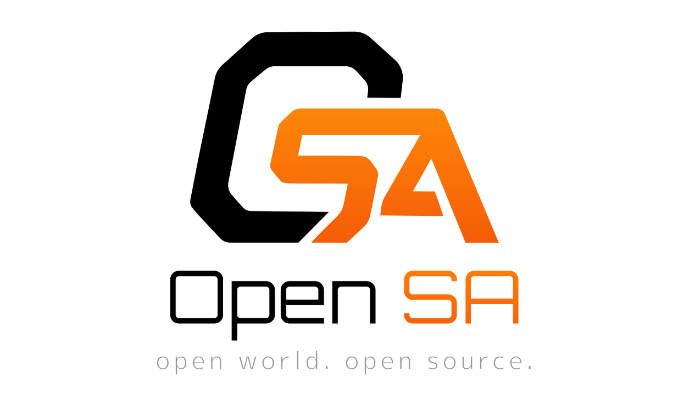

  

  
  

**Web Theft Auto San Andreas** is a browser-based GTA San Andreas reimplementation built around RenderWare
asset support, world streaming, physics, vehicles and gameplay systems. Bring your own game files and run the
world straight in the browser.

> Unofficial, non-commercial fan project. Not affiliated with Rockstar Games or Take-Two.

## Blog

Dev notes and progress - in [`/blog`](./blog).

- 2026-06-18 - [I ran GTA San Andreas on my own engine in the browser - solo with Claude, in 3 weeks](./blog/2026-06-18-i-ran-gta-san-andreas-on-my-own-engine-in-the-browser-solo-with-claude-in-3-weeks.md)

## What's inside

A TypeScript / three.js engine for RenderWare assets (DFF/TXD models, COL collision, IMG archives, IPL/IDE
world streaming) with a Rapier-physics player and vehicles — compatible with GTA San Andreas and its mods /
total conversions. See the [architecture overview](./docs/architecture.md) and the per-feature reference in
[docs/features/](./docs/features/).

## Contributing

Contributions are welcome - see **[CONTRIBUTING.md](./CONTRIBUTING.md)** for setup, the dev workflow, and
conventions. First-time asset setup: [docs/development/getting-started.md](./docs/development/getting-started.md).

## License

Copyright (c) 2026 Aleksandrov Sergey

The OpenSA source code is licensed under the **GNU Affero General Public License v3.0**
(AGPL-3.0). You may use, modify and redistribute it under the terms of that license; if
you run a modified version as a network service, you must offer its source to users. See
[LICENSE](./LICENSE) for the full text.

**This license covers only the original OpenSA code.** GTA San Andreas assets, models,
maps, names and trademarks are the property of Rockstar Games / Take-Two Interactive and
are **not** covered by it or distributed with this project. OpenSA is an unofficial,
non-commercial fan project, not affiliated with Rockstar Games or Take-Two.

## Legal & takedowns

OpenSA is an **experiment** and an unofficial, **non-commercial fan project**. It is **not affiliated with,
endorsed by, or sponsored by Rockstar Games or Take-Two Interactive**, and it is **not** a way to obtain,
copy, or redistribute their games — it's an alternative way to run a copy you already own.

- **No game assets are included or distributed in this repository.** To run the engine you must supply files
  from your own legitimate copy of the game (or a community mod you have the right to use).
- "Grand Theft Auto", "GTA", "San Andreas", RenderWare, and related names, logos and trademarks belong to
  their respective owners. They are used here **only descriptively**, to state what the engine is compatible
  with — not as branding.
- The public demo at [opensa.cc](https://opensa.cc) may load community **mod** content; all such content
  remains the property of its respective authors.

If you are a rights holder and believe anything here infringes your rights, please open an issue at
<https://github.com/AlexSergey/opensa/issues> or email the maintainer, Aleksandrov Sergey, at
<gooddev.sergey@gmail.com>, and we will review it in good faith and, where appropriate, **remove the material
promptly**.
